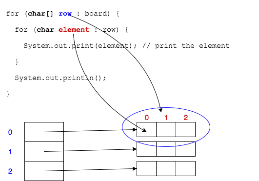

## Foreach Loops for Iterating Arrays

The "advanced for" or "foreach" loop is even better for iterating multidimensional arrays.

Remember we must always declare a local variable in the parentheses `()` of the loop.

```java
int[] ints = {1, 2, 4, 5};
for (int local : ints) {
  // ...
}
```

The same is true for multidimensional array, _but_ note the type of the local variable in the outer loop.

```java
for (char[] row : board) {
  for (char element : row) {
    System.out.print(element); // print the element
  }
  System.out.println();
}
```



### Drill
`AdvancedArrays/com.example.advancedarrays.drills.MultiForEach`
* Add a method called `printBands` that takes one parameter and prints each array using nested foreach loops.
* Call `printBands` from `main`.

<hr>

[Prev](for.md) -- [Up](README.md) -- [Next](shortcuts.md)

