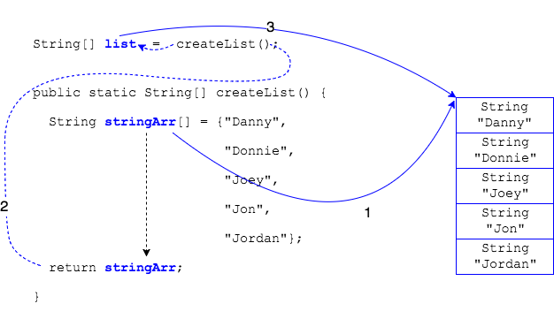

Many of the methods we have written have the return type of `void`.

* This means they don't return anything.

```java
public static void allSing(PopStar[] stars) {
  //...
}
```

Other methods return data.
* The type of the data is the _return type_ for the method.

This method returns a `String`.
* It _must_ return a `String` (or `null`).

```java
public static String addExclamations(String s) {
  String sExc = s + "!!!";
  return sExc;
}
```

We can call the method and assign the returned data to a variable.
```java
String output = addExclamations("Yo"); // output = Yo!!!
```

### Returning Array References

Using the same process, we can return arrays references from our methods.

This method creates a `String[]` and returns a reference to the array.
```java
public static String[] createList() {
  String stringArr[] = {"Danny", "Donnie", "Joey", "Jon", "Jordan"};
  return stringArr;
}
```

Again, we call the method and assign the returned reference to a variable.
```java
String[] list = createList();
```

### Practice Exercise
We can always tell what a method returns by looking at the return type. This is just what the Java compiler does to see if our method calls are legal.


The array is created inside a method, so why hasn't the array gone out of scope when the method ends?

* Inside the method, the array object is instantiated with the call to `new`. This makes it exist outside the method.
* The reference variable `stringArr` is like the address on a house.
* When we return the `stringArr`, we're returning a copy of the address.
* The calling method gets that address, so it knows where the array lives.



1. Java instantiates the array object.
2. `createList` returns the reference to the array.
3. Array reference is stored in a variable outside `createList` scope.

### Drill
`AdvancedArrays/com.example.advancedarrays.drills.ReturningArrays`
* Add a method called `public static PopStar[] createBand()`.
* Move the code that creates and fills a `PopStar` array into this method. Be sure to return the array from the method (since it's return type is `PopStar[]`).
* Call the method from `main` and store the array reference in a variable.
* Pass the array to the `allSing` method.
* Run the program.

<hr>

[Prev](arrays.md) -- [Up](README.md) -- [Next](arrays-of-arrays.md)

