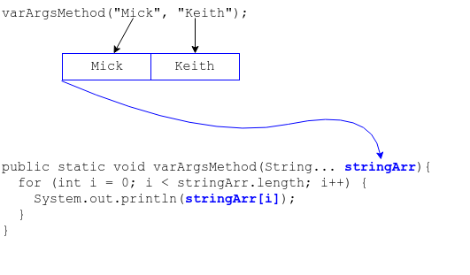

## Variable Arguments Arrays

Java has a feature where we can define a method to take a variable number of arguments.

* We call this feature _varargs_ and recognize it by the `...` in a method's parameter list.

```java
public static void varArgsMethod(String... stringArr){
  // ...
}
```

We can pass this method zero or more String arguments, separated by commas.

```java
varArgsMethod();
varArgsMethod("Mick", "Keith");
```

Java takes these zero or more String arguments and puts them into an array.

* We can access the `String`s by their array index.

```java
public static void varArgsMethod(String... stringArr){
  for (int i = 0; i < stringArr.length; i++) {
    System.out.println(stringArr[i]);
  }
}
```



### Practice Exercise
A varargs array parameter is never `null` - just like `main`'s `args`, you can safely access its `length` or iterate over its elements.
It is important to check the length of the array or use a _foreach_ loop, because the array could be zero-length.

### Varargs Is Always the Last Parameter
A varargs parameter must always be the last parameter in a method's parameter list.

Therefore, there cannot be more than one varargs parameter in a parameter list.

```java
// YES
public void varArgsMethod(int x, int y, String...stringArgs) {
  // ...
}

//NO - WILL NOT COMPILE, VARARGS MUST BE LAST
public void badVarArgsMethodFirst(String...stringArgs, int x) {
  // ...
}

//NO - WILL NOT COMPILE, VARARGS MUST BE LAST, intArgs IS NOT LAST
public void badVarArgsMethod(int...intArgs, String... stringArgs) {
  // ...
}
```

### Practice Exercise
A `main` method defined with varargs is legal, and the `java` command will be able to run a program with this `main` signature.

```java
public static void main(String... args){
  // ...
}
```

---

### Drill
`AdvancedArrays/com.example.advancedarrays.drills.VarArgsBand`
* Run the program, passing a band name and list of members. Is the output what you expected?
* Can you call the method with zero arguments? Why or why not?

<hr>

[Prev](shortcuts.md) -- [Up](README.md) -- [Next](labs.md)

