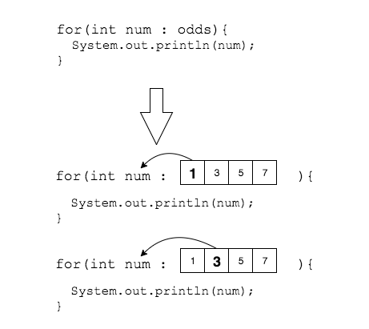

Java 5.0 added the _enhanced for loop_ to make it easier to step through a
collection, such as an array.

```
for (declaration : expression)
  statement;
```
The enhanced `for` loop is sometimes called the _for each_ loop.

The _for each_ loop iterates through each item in the collection, but does not use a control variable to do so. The example below shows a standard `for` loop, and then a _for each_ loop that does the same task.

```java
int[] odds = {1, 3, 5, 7};

for (int i=0; i < odds.length; i++){
  int num = odds[i];
  System.out.println(num);
}

for (int num : odds){
  System.out.println(num);
}
```
Each time through the loop, `num` is assigned a value from the array `odds`, in order.



When _for each_ loop has iterated through all elements in the array, it continues on the next line after the loop (like when a standard `for` loop's termination condition is false).

Because the _for each_ loop knows when it reaches the end of the array, it cannot cause an `ArrayIndexOutOfBoundsException`.

### Practice Exercise
You must declare a local variable inside the `for` loop's parentheses. This means you cannot reuse a variable you have already declared.

```java
// Legal
for (String s : stringArr){
  //...
}

// Illegal - compiler error
String s;
for (s : stringArr){
  //...
}
```


### Drill
`AdvancedForLoops/src/drills/ForEach.java`
* Use the code in each "forLoop" method to write a _foreach_ loop in the corresponding "forEachLoop" method. Verify that the loop outputs are the same.

<hr>

[Prev](nested-for.md) -- [Up](README.md) -- [Next](break-continue.md)

