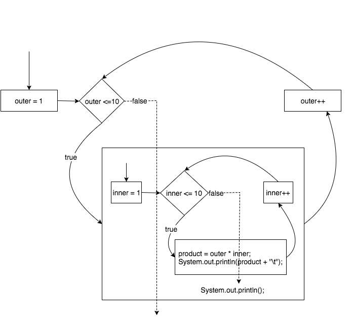

## Nested `for` Loops

Recall that a for loop iterates a certain number of times.

```java
for (int i=0; i < 10; i++) {
  System.out.print(i + " ");
}
//Output: 0 1 2 3 4 5 6 7 8 9
```

We can also put loops inside of other  loops.
* This is called a _nested loop_.

```java
for (int outer=1; outer <= 10; outer++) {

  for (int inner=1; inner <= 10; inner++) {
    int product = outer * inner;
    System.out.print(product + "\t");
  }

  System.out.println();
}
```
This code produces a multiplication table.

### A Nested `for` Loop Diagram



### Drill
`AdvancedForLoops/src/drills/NestedFor1.java`
* Run the program. How many times does the the second output statement execute?

Notice how the inner loop's control variable "starts over," i.e., gets re-initialized, every time the outer loop's control variable increments.
* The outer loop is like a big sprocket, and the inner loop like a little sprocket.
* For each turn of the outer loop, the inner loop turns many times.


### Drill
`AdvancedForLoops/src/drills/NestedFor2.java`
* Write a nested for loop to print the numbers 0 to 9 five times. Output:<br>
```
0 1 2 3 4 5 6 7 8 9
0 1 2 3 4 5 6 7 8 9
0 1 2 3 4 5 6 7 8 9
0 1 2 3 4 5 6 7 8 9
0 1 2 3 4 5 6 7 8 9
```

<hr>

[Prev](README.md) | [Up](README.md) | [Next](for-each.md)

