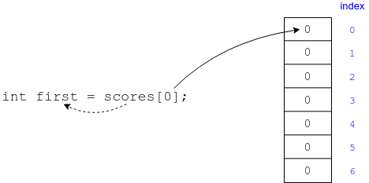
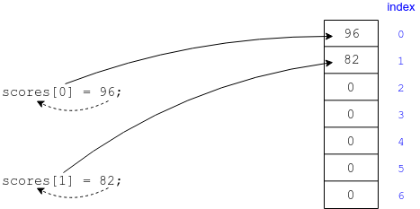

We use the variable name and `[]` to access elements in an array, and tell Java which element inside the `[]`.

### Reading a Value from an Array

```java
int first = scores[0]; // Remember that the first index is 0.
```
This takes the value at index `0` and stores it in the variable `first`.



### Storing a Value in an Array Position

Storing into an array position is the reverse of reading.
* We use the variable name and index, and assign a value to that slot.

```java
scores[0] = 96;
scores[1] = 82;
```



### Practice Exercise
Because the first index is always `0`, the last index is one less than the length of the array.

Trying to assign a value beyond the end of an array causes a catastrophic error in most languages.

```java
int[] scores = new int[7];
scores[7] = 41; // No such element!
```

### Drill
`Arrays/src/drills/ArrayAccess.java`
* Store the name of each weekday at the correct index.
* Store the grade A in the FIRST index of the array, and C in the LAST index of the array.
* Run the program and check the output to see if you were correct.


### Practice Exercise
The array operator has the highest precedence. That means when Java sees you are trying to read from an array, it will try to determine the array index before even looking at the array itself.

<hr>

[Prev](defaults.md) -- [Up](README.md) -- [Next](initializing.md)

