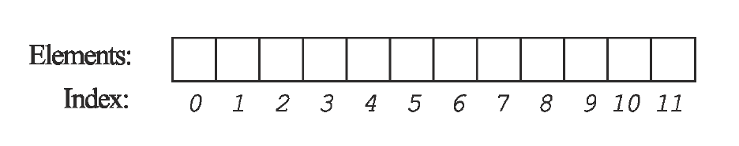

## Arrays

An array is a collection of data items with a single variable name.

The data items, or _elements_, of the array are stored in consecutive memory locations, and each is assigned a number: its _index_.

You use the array variable name and the index to access a particular element of the array.

### Practice Exercise
The first index in an array is `0`.

[Prev](variables.md) -- [Up](README.md) -- [Next](declaring.md)

