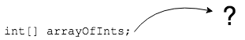
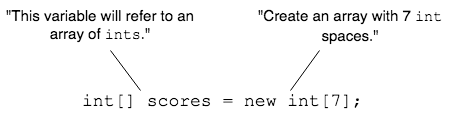

## Creating an Array

Declaring an array variable does not create the array.
* It simply tells Java the variable will point to an array.



To store items in it we must _instantiate_ the array.

> #### instantiate
> Make an instance of an object. This is a fancy way of saying "use `new` to create an object."

An array is an object so we use the `new` operator to create the array.

We must tell the compiler how many elements the array will contain.

```java
int[] scores = new int[7];
```
Look at what each side of the `=` is doing.



### Practice Exercise
The number of array slots _never_ goes in the declaration.
```java
int scores[7]; // WILL NOT COMPILE
```


### Drill
`Arrays/src/drills/ArrayCreate.java`
* Initialize the variable to hold 7 `String`s
* Initialize the variable to hold 6 `char`s.
* Initialize the variable to have the correct number of `double` slots.

<hr>

[Prev](declaring.md) -- [Up](README.md) -- [Next](defaults.md)

