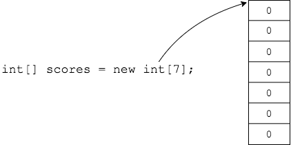

## Array Element Default Values

When we create an array, Java fills it with default values.

This is different than a local variable, which does not get a default value.

The default values for data types are listed below.

| Type    | Default Value |
| ----    | ------------- |
| int     | 0             |
| double  | 0.0           |
| char    | \u0000        |
| boolean | false         |
| objects | null          |

* `\u0000` is a _unicode_ character, which we will explain later.
* `String` is an example of an object.

### Practice Exercise
The _array variable_ itself must be initialized before use, but when the array is instantiated the elements are given default values.

[Prev](creating.md) | [Up](README.md) | [Next](access.md)

