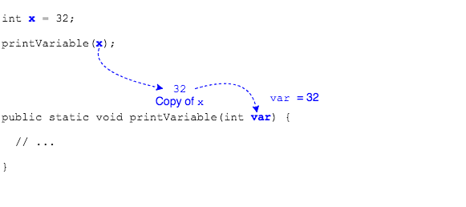
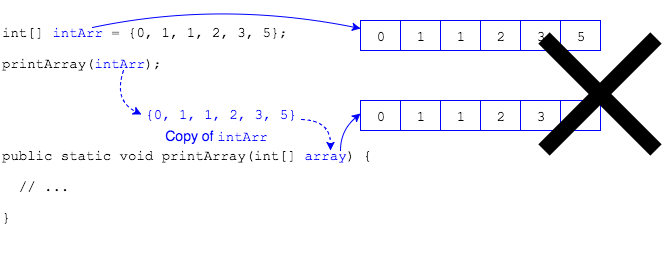
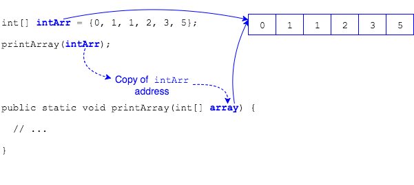
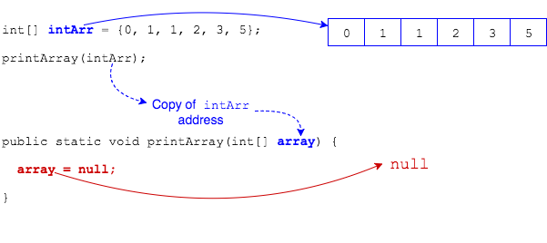

## Passing Arrays to Methods

We know that java is _pass-by-value_, meaning that data is copied to the method parameters when we pass it to a method.



We can define methods with array variables as parameters.

```java
public static void printArray(int[] array) {
  // ...
}
```

We would call this method by passing an array reference.

```java
intArr[0] = 0;
intArr[1] = 1;
intArr[2] = 1;
intArr[3] = 2;
intArr[4] = 3;
intArr[5] = 5;
printArray(intArr);
```

Java is still pass-by-value when we pass an array reference, but _the array itself is not copied_.



This would mean `intArr` and `array` are two different arrays. This is not the case.

Instead, the _reference_ is copied.
* Think of the reference like a street address.
* Passing the reference to a method copies the street address into the method parameter.
* The method now knows where the original array "lives" because it has a copy of the address.



This means that changes in the method will affect the original array.

However, assigning a new reference to the method parameter does not affect the original array.



### Drill
`Arrays/src/drills/ArrayReferences.java`
* Call the `changeArray` method and pass the daysOfWeek array reference.
* Change Wednesday to "HUMPDAY" and Friday to "Viernes". (There is no need to iterate, just change the right index.)
* Reassign `inputArr` to a new array containing the values "Su", "M", "T", "W", "Th", "F", "Sa"
* Refactor the printing of the array into a method and pass it the daysOfWeek array reference.

<hr>

[Prev](iterating.md) -- [Up](README.md) -- [Next](three-ways.md)

