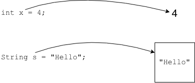
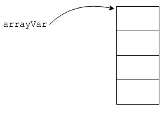

## Variables - Single vs. Collections

Up to this point, we have been using variables that hold one piece of data.

### Practice Exercise
Another word for a variable that holds a single piece of data is _scalar_.

Data _collections_ are, as the name implies, collections of multiple pieces of data.

_Arrays_ are one of the primary data collections in Java.

An array allows us to have a single variable that points to multiple pieces of data.

[Prev](README.md) | [Up](README.md) | [Next](array.md)

