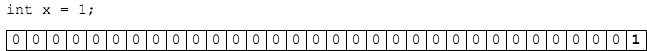

### Bits and Bytes

The smallest unit of memory Java uses is a `byte`.

A `byte` is 8 bits, each set to 0 or 1.


### Variables and Memory
When we declare a variable, Java reserves enough memory for that variable type.

Assigning a value to a variable puts 0's and 1's into that memory.

Below we declare an `int`, which uses 4 bytes, and give it the value 1.

```java
int x = 1;
```



### Memory Sizes You May Have Seen
1,024 bytes is a _kilobyte (KB)_.

1,024 kilobytes is a _megabyte (MB)_.

1,024 MB is a _gigabyte (GB)_.

Why 1024? Because 1024 is 2<sup>10</sup>, and powers of 2 matter in binary (0's and 1's).

### Practice Exercise
Technically a kilobyte (KB) is a power of 10, so 2<sup>10</sup> is actually a _kibibyte_ (KiB). Megabyte (MB) is also a power of ten, so  2<sup>20</sup> is a _mebibyte_ (MiB).

You can piece together how the names relate.

`kibi = kilo - lo + bi (for binary)`

`mebi = mega - ga + bi`

<hr>

[Prev](memory.md) -- [Up](README.md) -- [Next](binary-math.md)

