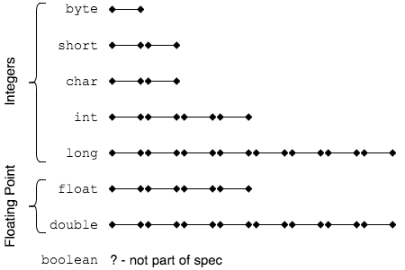

Study the diagram below to remember how primitive data types are related, and how many bytes they each use.

When we store a value in a variable, we are storing 0's and 1's in the bytes.

### Practice Exercise
Note that `char` is part of the Integer family. This means we can treat it as a number and add to it.

 

### Drill
`DataTypes/com.example.datatypes.drills.CharAsInteger`
* Declare a `char` variable and assign it the value `65`. This stores `0000000001000001` in memory. Print the variable to the screen.
* Use the `+=` operator to add 25 to your variable. Now print it to the screen.

  You can see that `char` is just a set of bits, and Java interprets the value based on the data type.

[Prev](primitives.md) -- [Up](README.md) -- [Next](types-matter.md)

