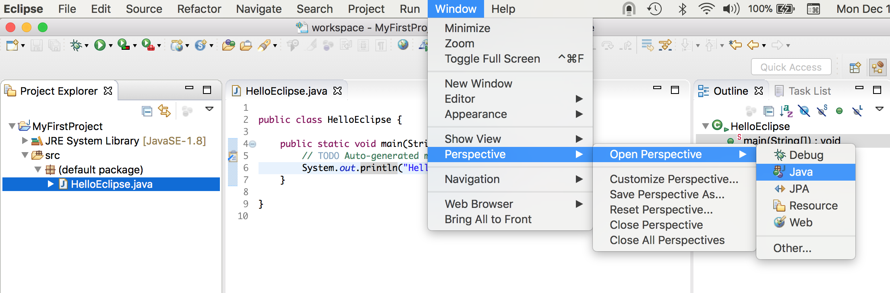

You use an _Editor_ to enter text into Eclipse.

* The JDT _Java Editor_ provides syntax coloring, code completion, code recommendations, and code formatting, among other features.

* A simple text editor is also included as part of the Eclipse Platform.

* Other editors, such as an HTML editor, can be added as plug-ins.

* Multiple editors can be open at once and they will appear as stacked instances with individual tabs for selection.

_Views_ display information about an object; they typically supplement the data that is visible in the current editor.

* The JDT provides a _Package Explorer_ and _Outline_ views, among others.

* You'll see compiler errors in the _Problems_ view

* Text your program outputs will show in the _Console_ view.

  * If your program reads data from `System.in` (say, using a `Scanner`), you can type it in the console.

* Display additional views by choosing _Window_ | _Show View_.

A _Perspective_ is a pre-defined combination of editors and views arranged in the workbench for a particular kind of programming.

* You can switch from one perspective to another to see the appropriate combination of views and editors for your current needs by choosing _Window_ | _Open Perspective_.

* The _Window_ menu also allows you to save, customize, reset, and close Perspectives.

The _Java EE_ perspective is the default perspective that you will see after dismissing the welcome screen.

* It includes the kind of views a developer would use while working on Java web applications.

* Eclipse remembers which views you've used recently and provides buttons at the top right to switch back and forth.

### Drill
Take a close look at the buttons across the top of Eclipse.  Hover over each one to show what they do.  Also go to _File_ | _New_ to see what wizards are listed there in the current, _Java EE_ perspective.  Look at the names of the views along the bottom.
* Go to _Window_ | _Perspective_ | _Open Perspective_.
* Choose _Java_.
Notice the different views and buttons:
* On the left, instead of _Project Explorer_ you see _Package Explorer_.
* There's now a _New Class_ button in the button bar.
* The _File_ | _New_ menu is now very different.

Close the _Outline_ view on the right, and close the _Package Explorer_ view on the left.
* Now go to _Window_ | _Perspective_ and choose _Reset Perspective..._, answering **Yes** at the prompt.  

Let's open a new view:
* Go to _Window_ | _Show View_ and choose _Tasks_.
  * This view looks for Java comments of the form `// TODO ...` and displays them.

We'll stay in the _Java_ perspective for this part of the program.

[Prev](startingAProject.md) -- [Up](README.md) -- [Next](javaEditor.md)

