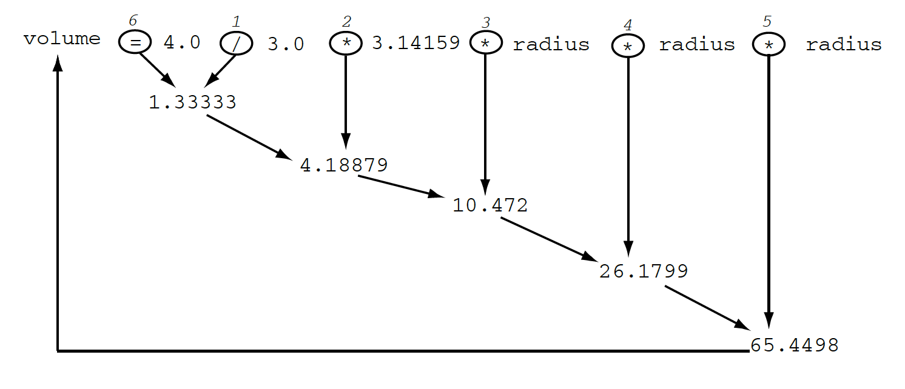

## Arithmetic Expressions

Arithmetic expressions translate mathematical formulas into computer
instructions.

Most arithmetic operators take two operands. (We would say they are _binary_ operators.)

* Addition and subtraction of two numbers:
  ```java
    length + 6.13
    5 - radius
  ```
* Multiplication and division of two numbers:
  ```java
    width * height
    total / 2
  ```
* Modulus (remainder) of two numbers:
  ```java
    15 % 4
    year % 100
  ```

### Practice Exercise
The modulus, `%`, gives us the remainder, telling us if the first number is divisible by the second.  For example, 13 divided by 5 is 2, leaving a remainder of 3:
* `13 % 5 == 3`
* `14 % 5 == 4`
* `15 % 5 == 0` : 15 is divisible by 5.

A particularly important use of this is determining if a number is odd or even.
* `3 % 2 == 1` : 3 is odd
* `4 % 2 == 0` : 4 is even
* `5 % 2 == 1` : 5 is odd
* `6 % 2 == 0` : 6 is even

A few operators work with just one operand (_unary_ operators):

* To use the negative of a variable's value, precede it with the `-` operator:

  ```java
    -score
  ```
  * There is a unary `+` operator, but using it doesn't do anything.

Many subexpressions can be combined to form a final result:

```java
volume = 4.0 / 3.0 * 3.14159 * radius * radius * radius;
```

Expressions often have many operators. Each operator is evaluated in turn (left to right), with the result used as an operand for the next operator.

For example, if `radius` is 2.5, the operands are derived in the order 1-6:



### Drill
`Expressions/src/drills/Arithmetic.java`
* Run this program with several numbers. What happens to the remainder when you do integer division?
* Comment out the call to doDivision();
* Uncomment the call to doModulus();
* Complete the method and use the modulus operator to find the remainder.


> `Expressions/src/drills/MilesPerGallon.java`
> * Complete the code according to the TODO's in comments.

<hr>

[Prev](assignment.md) -- [Up](README.md) -- [Next](relational.md)

