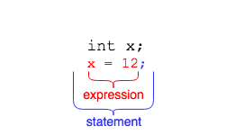
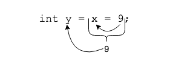

Assignment expressions assign data to a variable.



Data comes from the right side of the `=` operator and goes to the left.
```java
int x;
x = 12;
```
Assignment also evaluates to a value. This is why we can have multiple assignment statements in a row.
```java
int x;
x = 12;
int y = x = 9; //x and y both have value 9
```
The value 9 is assigned to x, and the _result_ of that evaluation is assigned to y.



### Drill
`Expressions/src/drills/Assignment.java`
* In main, uncomment the call to the method `intAssignment()`. Run the following code.

  ```java
    int x = 12;
    System.out.println("x is " + x);
    System.out.println(x = 99);
    System.out.println("x is now " + x);
  ```
* Notice how `x` is assigned inside the `System.out.println()` statement and its value is printed to the screen. This is because assignment results in a value.
* Now comment the call to `intAssignment()` and uncomment `booleanAssignment()` Run the following code.

  ```java
    boolean value = false;
    System.out.println("value is " + value);
    System.out.println(value = true);
    System.out.println("value is now " + value);
  ```
  The result of the `boolean` assignment was a `true` value.

<hr>

[Prev](evaluation.md) -- [Up](README.md) -- [Next](arithmetic.md)

