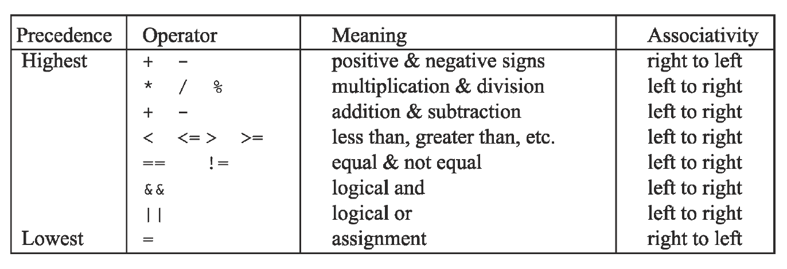

## Precedence Order

Below is the precedence table for operators we have seen so far.



### Practice Exercise
Notice that assignment, `=`, has the lowest precedence of all.  This is so that all calculations in a statement complete before the result is assigned to a variable.

Using the fact that `&&` has higher precedence than `||`:
```java
b < 42 || c > 50 && c < 100
```
the computer will evaluate the expression as if it looked like this:
```java
( b < 42 ) || ( c > 50 && c < 100 )
```
So, if b is 10 and c is 25, is the final result true or false?

### Drill
`Expressions/src/drills/Precedence.java`
* The methods in this program have bugs. Uncomment methods one at a time to see output.
* Change the statements in each method to produce the expected result. You can only use parentheses.

<hr>

[Prev](precedence.md) -- [Up](README.md) -- [Next](labs.md)

