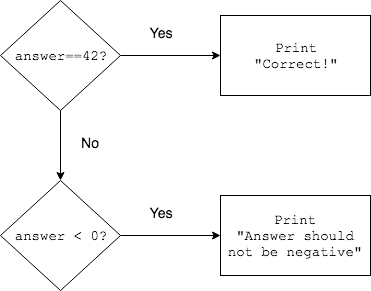

## `if` and `else if`

We may want to test additional conditions _only_ when a first one is not `true`. We can do this with `else if`.

```java
if (firstCondition) {
  body to execute when first condition is true
}
else if (secondCondition) {
  body to execute when firstCondition was false AND secondCondition is true
}
```
The `if` and `else if` are now considered one "control flow" statement.
* They are tied together; the `else if` will only evaluate `secondCondition` when `firstCondition` is `false`.

Adding to our previous example

```java
if (answer == 42) {
  System.out.println("Correct!");
}
else if (answer < 0) {
  System.out.println("Answer should not be negative");
}
```
The flow chart for this now has two decision diamonds.



### Practice Exercise
An `else if` can only be placed immediately after an `if` statement, because it is the condition we test _only_ if the first condition is `false`.

This will not compile.
```java
int age = 16;
if (age < 12) {
  System.out.println("Can buy a kids' meal.");
}
boolean canDrive = age >= 16;
else if (canDrive) { //does not follow if statement
  System.out.println("Can drive.");
}
```


### Drill
`IfElse/src/drills/SalaryDecisions2.java`
* Change the code to use `else if` according to the TODO's.

<hr>

[Prev](codeblock.md) -- [Up](README.md) -- [Next](else.md)

