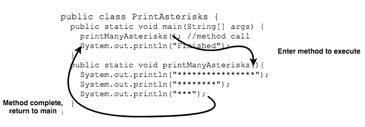

## Calling Methods

Call a method within the same class by using its name and parentheses, followed by a semicolon.

```java
public class PrintAsterisks {
  public static void main(String[] args) {
    printManyAsterisks(); // method call
    System.out.println("Finished");
  }

  public static void printManyAsterisks() {
    System.out.println("****************");
    System.out.println("********");
    System.out.println("***");
  }
}
```

Java executes code _sequentially_, or line-by-line.
* When it reaches the `printManyAsterisks` call in `main`, it jumps into the body of the `printManyAsterisks` method.
* The method will execute its statements until it reaches the end of the method body.
* Then the code returns to `main`, and executes the line `System.out.println("Finished");`.
* The program ends when `main` reaches the end of its method body.



### Practice Exercise
Another word for "call" is "invoke."

<br >

### Drill
`introtomethods/drills/CallingMethods.java`
* Run the `CallingMethods` class. Compare the output to the method calls within the code; follow the trail of method calls.

<hr>

[Prev](method-def.md) -- [Up](README.md) -- [Next](main.md)

