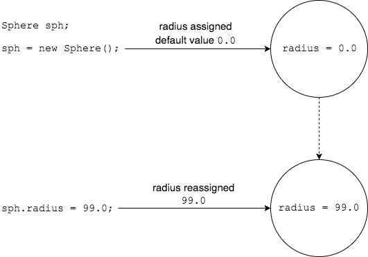
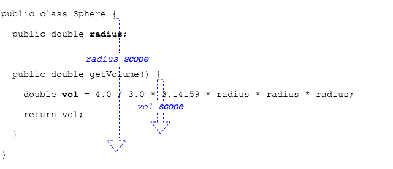

Fields are given a default value when an object is created.

The default value for `int` is `0`.
* For `double` fields, the default is `0.0`.

For `String` and other object types, the default value is `null`.

> #### null
> A special value in Java that means a variable has been initialized, but doesn't point to an actual object.

 

### Practice Exercise
Fields are different than local variables (variables declared inside a method) in that local variables _must_ be initialized before they're used.

Fields will always have a value because Java inserts default values.

### Scope

A variable's _scope_ defines where it can be used in code.
* Think of _scope_ as the pair of curly braces `{ }` where a variable is defined.

Variables are available to all `{ }` nested inside the `{ }` where they are defined.
* Local variables are defined inside a method, and available to an `if` statement's code block.
* Fields are defined outside any method definition, so they are available to methods.

Fields can be defined above, between, and below the method definitions, but are usually placed at the top of the file.

[Prev](state-behavior.md) -- [Up](README.md) -- [Next](static.md)

