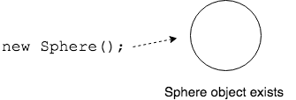

## Creating Objects

The `Sphere` class is a blueprint for creating `Sphere` objects.

An _object_ is an individual thing in the program created using a `class` and the `new` operator.

| class | object |
|-------|--------|
| Blueprint for creating objects | Instance created using the blueprint |

> #### instance
> One distinct occurance of an object whose state and behavior is defined by a class.  _Object_ and _instance_ both mean the same thing and are used interchangeably.

`new` tells Java to create an _instance_ of this class.
* We use the class name and parentheses `()` with the `new` operator to create the object.

* This tells Java to build a new object, with enough memory for all of the object's data.
* This is called _instantiation_.

> #### instantiation
> The creation of a new object with all its data, based on the definition in the class.  Also known as _construction_.

[Prev](classes.md) -- [Up](README.md) -- [Next](references.md)

