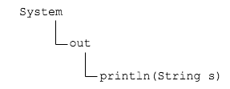

## Some Objects You've Already Met

We have been using objects in programs already.
* Every time you see the `new` operator, we are creating an object.

### `String`

Strings are objects whose state is a group of characters.

We have already seen some of a String's behavior (methods), but some other methods are useful.
* `boolean equals(String anotherString)` - returns `true` if all characters match.
* `boolean equalsIgnoreCase(String anotherString)` - like `equals` but ignoring upper vs. lowercase.
* `char charAt(int index)` - get an individual character from the String, where the first character's `index` is `0`.

### Practice Exercise
We often do not see `new` used when creating `String` objects. This is because `String`s are so important to Java that its creators gave us a shortcut to create `String` instances.

```java
String importantString = "Important!"; //no new operator, but object created
```


### `java.util.Scanner`

We create `Scanner` objects to interact with the keyboard, and call that object's methods to get input.

```java
java.util.Scanner scanner = new java.util.Scanner(System.in);
System.out.print("Enter the radius of the sphere: ");
double radius = scanner.nextDouble();
scanner.close();
```

(Note: Passing `System.in` into the Scanner's parentheses `()` is a special way to give data to an object, which we will get into later.)

### `System.out`
Calling `System.out.println()` works out this way.

The `System` class has a `static` field `out`, which has a method `println`.



<hr>

[Prev](static.md) -- [Up](README.md) -- [Next](labs.md)

