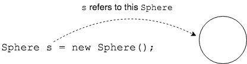
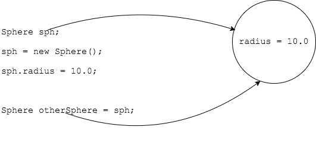

## Reference Variables

`new` simply creates the object.
* To use the object we need a variable to actually refer to it.



The variable has a _type_ and _name_, only instead of one of the Java's primitive types, the type is a class.

Since this variable "refers" to an object, we call it a _reference_ or _reference variable_.

> #### reference
> A variable that can refer to ("point to", "equal") an instance.

The reference allows us to control an instance.

### Declaring and Assigning Reference Variables

Declaring a reference variable does not create the object.
* `new` creates the object.
* We assign the new instance to a reference variable so we can use the object.

```java
Sphere sph;         // Declare reference variable
sph = new Sphere(); // Create new Sphere instance and assign to
                    // reference variable
```

### Many References to One Object

We can have two (or more) references point to a single object.

This means both references control the same object.

```java
Sphere sph;               // Declare reference variable
sph = new Sphere();       // Create new Sphere instance and assign to
                             // reference variable
sph.radius = 10.0;

Sphere otherSphereRef = sph; // Now otherSphereRef refers to the object sphRef refers to.
```



### Drill
`IntroToObjects/src/drills/SphereReferences.java`
* Create another reference called `otherSphereRef` and assign sphRef to it, so that both references refer to the same Sphere object.
* Change `otherSphereRef`'s radius.
* Output `otherSphereRef`'s radius to the screen.
* Output `sphRef`'s radius to the screen. It should have changed.

<hr>

[Prev](object-creation.md) -- [Up](README.md) -- [Next](state-behavior.md)

