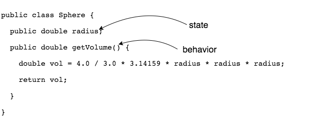
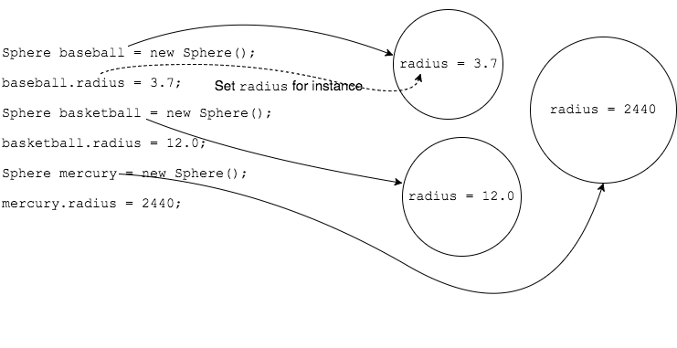

## State and Behavior

Recall the blueprint (class) for creating `Sphere` objects.

```java
public class Sphere {
  public double radius;

  public double getVolume() {
    double vol = 4.0 / 3.0 * 3.14159 * radius * radius * radius;
    return vol;
  }
}
```

Each object has _state_ and _behavior_.

> #### state
> Data each object has; what the object **knows** about itself.


> #### behavior
> Methods we can call on an object; what the object **does**.



The variable `radius` is an example of an _instance variable_ or _field_.

> #### instance variable
> A variable defined inside a class but outside of any method definition. Each object gets its own copy of the `class`'s fields.

Every instance of a class gets its own copy of variables (fields).

The code below creates three `Sphere` objects and sets each object's field to a unique value.



We access an object's instance variable by using its reference variable with the `.` operator, using the form `reference.instanceVariableName`.

We call methods using the reference and `.` operator, but with a method call.
* This way we are telling _a certain object_ to do something.

### Drill
`IntroToObjects/src/drills/SphereWithColor.java`
* Add a `String` field for `color`.
* Add a method called `displaySphere`.
  * return type: `void`
  * parameters: none
  * functionality: Prints the object's `radius`, `color`, and volume to the screen.

`IntroToObjects/src/drills/SphereWithColorTest.java`
* Create several `SphereWithColor` reference variables and `new` objects.
* Initialize each object's `color` and `radius` fields.
* Call `displaySphere` for each object.
* Create another `SphereWithColor`, but **do not** initialize its fields.
* Call its `displaySphere` method. What values do you see?  

<hr>

[Prev](references.md) -- [Up](README.md) -- [Next](fields.md)

