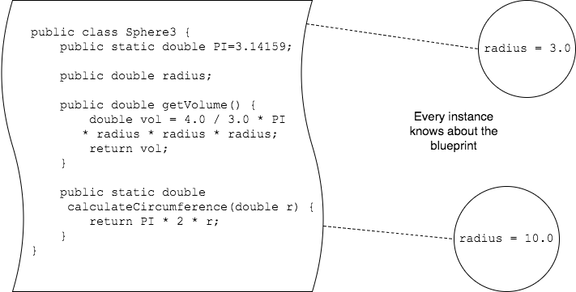

## The `static` Keyword

Up to now, we've seen the keyword `static` in front of all of our methods.

```java
public static void convertTemperature(double temp, char celsOrFahr) {
  //...
}

public static void isOddOrEven(int number) {
  if (number % 2 == 0) {
    System.out.println(number + " is even");
  } else {
    System.out.println(number + " is odd");
  }
}
```

There are also `static` fields.
* The class below has a `static` field for `PI`.

```java
public class Sphere2 {
  public static double PI = 3.14159;

  public double radius;

  public double getVolume() {
    double vol = 4.0 / 3.0 * PI  * radius * radius * radius;
    return vol;
  }
}
```

`static` means a method or field is part of the class (blueprint) itself, and not tied to a specific instance.

Each instance of a class knows about the blueprint used to create it, so it can refer to `static`s.



### Practice Exercise
Java stores `static` methods and fields in the definition of the class, separate from each instance. It's as if statics are part of the blueprint itself.

This is different than an instance field because we need an actual object to hold an instance field.

### Notes on `static`
* There is only _one_ of each static field that _all_ instances share.
* Any instance of the class can call a static method or refer to a static field.

`static`s are different than an instance method or field, which can only be used when you have an instance of an object.

This class has a static field for `PI` and a static method to calculate a circumference.

```java
public class Sphere3 {
  public static double PI = 3.14159;

  public double radius;

  public double getVolume() {
    double vol = 4.0 / 3.0 * PI  * radius * radius * radius;
    return vol;
  }

  public static double calculateCircumference(double r) {
    return PI * 2 * r;
  }
}
```

### Using Static Fields and Methods

Normally we refer to static fields and call static methods by using the _class name_, rather than using an instance variable.

```java
Sphere3 sp = new Sphere3();
System.out.println("PI is " + sp.PI);         // NO (though it's legal)
System.out.println("PI is " + Sphere3.PI);    // YES

double circ = sp.calculateCircumference(5.0); // NO (though it's legal)
circ = Sphere3.calculateCircumference(5.0);   // YES
```
Using an instance variable to refer to a static field or method will compile and run, but other developers do not write code this way.

### Practice Exercise
We can directly refer to `static` fields from instance methods, but not instance fields from `static` methods.

This is because instance fields are always part of an actual instance of a class, while `static` methods are part of the class definition.

```java
double rad = Sphere3.radius;  // WILL NOT COMPILE
                              // Can't have a radius without an actual Sphere object.
```


<hr>

[Prev](fields.md) | [Up](README.md) | [Next](objects-used.md)

