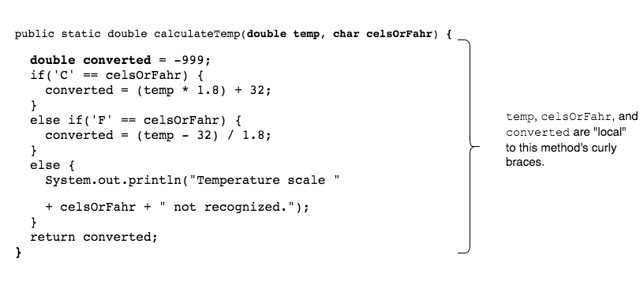

## Local Variables

Parameters are variables that hold values for the data a caller passes.

Inside a method, we can declare other variables, called "local" variables.

> #### local variable
> A variable declared within a method.

Variables declared inside a method are called "local" because their scope is limited to the method.
* This means the variables cannot be used outside the method's curly braces `{ }`.

### Practice Exercise
A local variable must be initialized before you can use it.

A parameter is like a local variable because its scope is also the method's curly braces.

### Drill
`Methods/src/drills/StringManipulation.java`
* Complete items 1 - 3 according to the directions.

  (Solution: _StringManipulation.java_)

* (Optional) Add a third parameter `String charToAdd` to `addCharacter`.
  Concatenate this character instead of `!`.
  In main, prompt the user for a character to add, and pass the String to `addCharacter`.
  
  (Solution: _StringManipulation2.java_)

[Prev](parameters2.md) -- [Up](README.md) -- [Next](pass-by-value.md)

