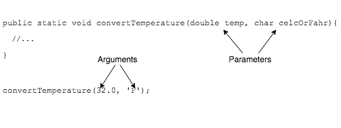

## Defining Parameters

We can define methods to have multiple parameters in their parentheses.

```java
public static void convertTemperature(double temp, char celsOrFahr) {
  //...
}
```

The name of the method, along with its list of parameter datatypes, is termed the method's _signature_.

> #### signature
> A method's name and list of parameter datatypes.

### Defining Multiple Parameters

* Method parameters are separated by commas in the method's parentheses.

* Each parameter needs a type (even if all parameters are the same type).

* Order of parameters matters.
  * Users of the `convertTemperature(double temp, char celsOrFahr)` method _must_ pass a `double` and `char`, in that order.

### "Parameters" vs. "Arguments"

You may hear the word "arguments" in place of "parameters" - they are different things:
* A method **uses** parameters defined in its parentheses.
* A caller **passes** arguments to a method.



> #### parameters
> Variables a method uses.


> #### arguments
> Data a caller passes when calling a method.


### Drill
`Methods/src/drills/CalculateTemp.java`
1. Define a method with the following signature:
   ```
   name: calculateTemp
   return type: double
   parameter 1: floating point temperature
   parameter 2: a character denoting the temperature scale, where 'C' means Celsius and 'F' means Fahrenheit
   Be sure to put "public static" in front of the method return type and name
   ```
   Add the method's functionality according to directions.

1. Call the method to calculate temperature. Be sure to pass arguments in the correct order.

<hr>

[Prev](parameters.md) -- [Up](README.md) -- [Next](local-variables.md)

