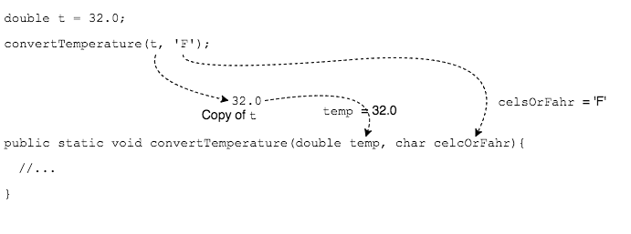

## Pass-by-value

Parameters are like local variables in that their scope is limited to the method's curly braces `{ }`.
* The difference is that a parameter will always be initialized with data from a caller.

When a caller calls a method, Java **copies** the caller's data into method's parameter.
* This is known as _pass-by-value_.

> #### pass-by-value
> Copying data from a method argument into a method parameter.

This means the caller's variable and method's parameter **are not linked**, so assigning a new value to the parameter will not change the caller's variable.

Think of the parameter as a local variable with a copy of the caller's data.

### Drill
`Methods/src/drills/PassByValue.java`

Complete the drill according to the instructions. Note that the local variable `x` in `main` can have the same name, `x`, as the `changeIt` method parameter. This is because they are each "local to" their respective methods.

### Practice Exercise
"Is Java _pass-by-value_ or _pass-by-reference_?" is a common interview question.

Java is pass-by-value because data is copied from the caller to the method parameters, so assigning a different value to a parameter will not change a caller's variable.

In pass-by-reference programming languages, assigning new data to a method parameter _could_ change the caller's variable.

[Prev](local-variables.md) | [Up](README.md) | [Next](overloading.md)

