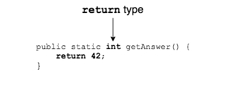
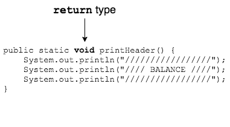

Methods can do more than just separate code: they can also _return_ data to the methods that call them.

We know that in Java, all variables have a type (`int`, `char`, `String`, etc.).

Methods have a _return type_ which tells the type of value a method will return.

* This method will return an `int` value.

  

* This method does not return any value.

  

  * Every method needs a return type, so this method's return type is `void`.

The return type determines what a method **must** return.
* If its return type is `int`, it must return an `int` value.
* If its return type is `void`, it cannot try to return a value.

### Practice Exercise
A method with a `void` return type can still have a `return` statement with no value. This just tells the method to end so the program jumps back to the caller.
```java
public static void checkForEven() {
  int x = 0;
  //...
  if (x % 2 == 0) {
    return; //exit this method
  }
  System.out.println("x is not even");
}
```
However, a `void` method is not required to have a `return` statement.

<br />

### Practice Exercise
The code below generates a compiler error.

```java
public static int compilerError() {
  int x = 0;
  //...
  if (x == 0) {
    return -1;
  }
}
```
This method **must** return an `int`. The compiler sees that it only returns a value when `x == 0`, so it sees a path through the code where no value is returned. That is illegal.

<hr>

[Prev](repeated-code.md) -- [Up](README.md) -- [Next](using-return.md)

