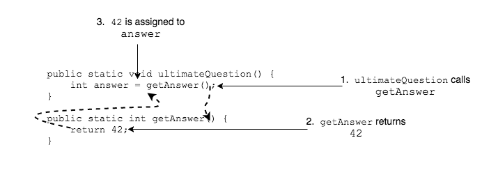

When we call a method, we can use its `return` value by _assigning_ it to a variable.

```java
public static void ultimateQuestion() {
  int answer = getAnswer();
}

public static int getAnswer() {
  return 42;
}
```
The value 42 is returned from `getAnswer` and assigned to the variable `answer`.



### Drill
`Methods/src/drills/CalculateBalanceReturn.java`
We are going to refactor the CalculateBalance class into more methods.
* Declare a method called `buildHeader` that returns a `String`.
* This method will return a `String` for the "BALANCE" header. Use the following code.

```java
public static String buildHeader() {
  String header = "/////////////////\n"
                + "//// BALANCE ////\n"
                + "/////////////////";
  return header;
}
```
* "Refactor" `printHeader()` to use `buildHeader()`:
  1. Remove its `System.out.println` statements.
  2. Inside `printHeader`, call `buildHeader()` and assign its return value to a variable.
  3. Output that variable to the screen.

<hr>

[Prev](return.md) -- [Up](README.md) -- [Next](parameters.md)

