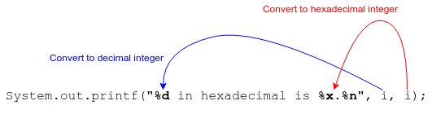
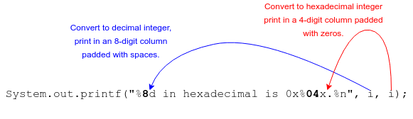
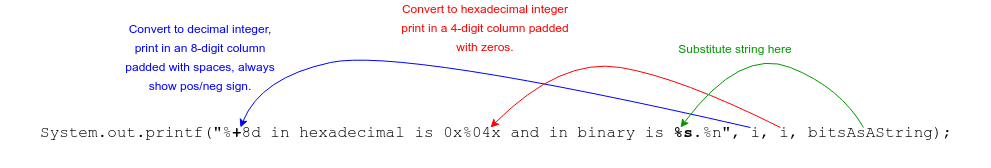
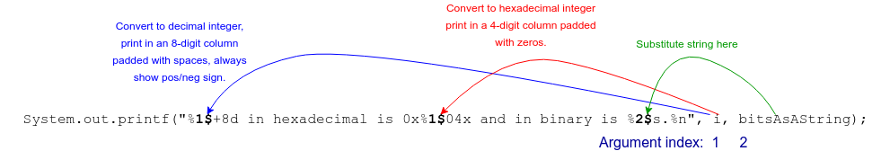

## The `printf()` Method

In addition to `println()`, `System.out` provides the `printf()` method to print formatted strings.

```java
int i = 17;
System.out.printf("%d in hexadecimal is %x.%n", i, i);
// 17 in hexadecimal is 11.
```

`printf()` takes a format string and a variable list of arguments (an example of a _varargs_ method.)

The format string contains literal text, as well as _format specifiers_ that start with `%`.

* Each parameter after the format string is substituted into the corresponding format specifier for output.

* The letter in the format specifier tells `printf()` how to convert the value for printing:

  * `d` - as a decimal integer
  * `o` - as an octal integer
  * `x` - as a hexadecimal integer
  * `f` - as a floating-point number
  * `a` - as a floating-point number in hexadecimal
  * `s` - as a string

Other special format specifiers include:

* `%n` - a newline: unlike `println()`, `printf()` doesn't output a newline unless you tell it to.
* `%%` - a literal `%`.



Between the `%` and the letter you can specify column width, padding, precision, and other niceties.

```java
System.out.printf("%8d in hexadecimal is 0x%04x.%n", i, i);
//      17 in hexadecimal is 0x0011.
```



* `-` in the specifier means left-justify and pad with spaces out to the column width.
* `0` in the specifier means pad with leading zeros out to the column width.
* `+` in the specifier means indicate the number's sign with `+` or `-`.
* `(` in the specifier means put negative numbers in parentheses.


* You can find full details of format strings in the Java Platform API documentation: [Format String Syntax](https://docs.oracle.com/javase/8/docs/api/java/util/Formatter.html#syntax)

### What about binary?

`printf()` doesn't have a format specifier for outputting a number in binary.

However, there is an `Integer` class with the method `toBinaryString(int n)`.

```java
String bitsAsAString = Integer.toBinaryString(i);
System.out.printf("%+8d in hexadecimal is 0x%04x and in binary is %s.%n", i, i, bitsAsAString);
//     +17 in hexadecimal is 0x0011 and in binary is 10001.
```



### Argument Indexes

`printf` expects an argument for each format specifier in the format string, but you can re-use arguments by providing an _argument index_ inside a specifier.

* Arguments after the format string are numbered starting at `1` and specified with a `$`.

```java
System.out.printf("%1$+8d in hexadecimal is 0x%1$04x and in binary is %2$s.%n", i, bitsAsAString);
//     +17 in hexadecimal is 0x0011 and in binary is 10001.
```




<hr>

[Prev](javaLiterals.md) | [Up](README.md) | [Next](labs.md)

