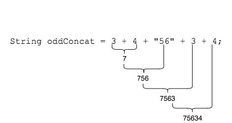

## String Output

We have seen how the `+` sign between `String` variables or literals _concatenates_ them.

> #### concatenation
> Joining strings end to end.
> ```java
>   System.out.println("snow" + "ball");
>   //Output: snowball
> ```

### Drill
`screenoutputkeyboardinput/drills/StringOutput.java`
* Examine the code and add what you expect the output to be in each comment.
* Then run the code.

The final example is tricky because of how Java uses the `+` operator. Here is another example.
```java
String oddConcat = 3 + 4 + "56" + 3 + 4;
System.out.println(oddConcat);
```
This code outputs `75634`.

The reason is that Java will add numbers around the `+` operator until it sees a String on one side of the `+`; then it will use the `+` operator for concatenation.



### Practice Exercise
You can force String concatenation by preceding a variable with an empty String, `""`. Note that this empty String is not a space character.
```java
System.out.println("" + 4 + 2);
//Output: 42 instead of 6
```

<hr>

[Prev](formatting.md) | [Up](README.md) | [Next](input.md)

