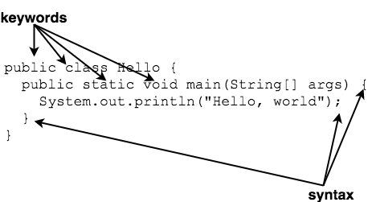

## Programming Languages ##
Programs are written in a programming language.

A programming language is a set of instructions that another program can read. It consists of keywords (vocabulary) and the order in which they make sense (syntax).

Another word for an Java instruction is a _statement_. Think of a statement like a complete sentence in English.

Statements in Java end with a semicolon (`;`).

When you compile your program, the compiler is checking your use of keywords and syntax.

[Prev](programming-process.md) -- [Up](README.md) -- [Next](errors.md)

