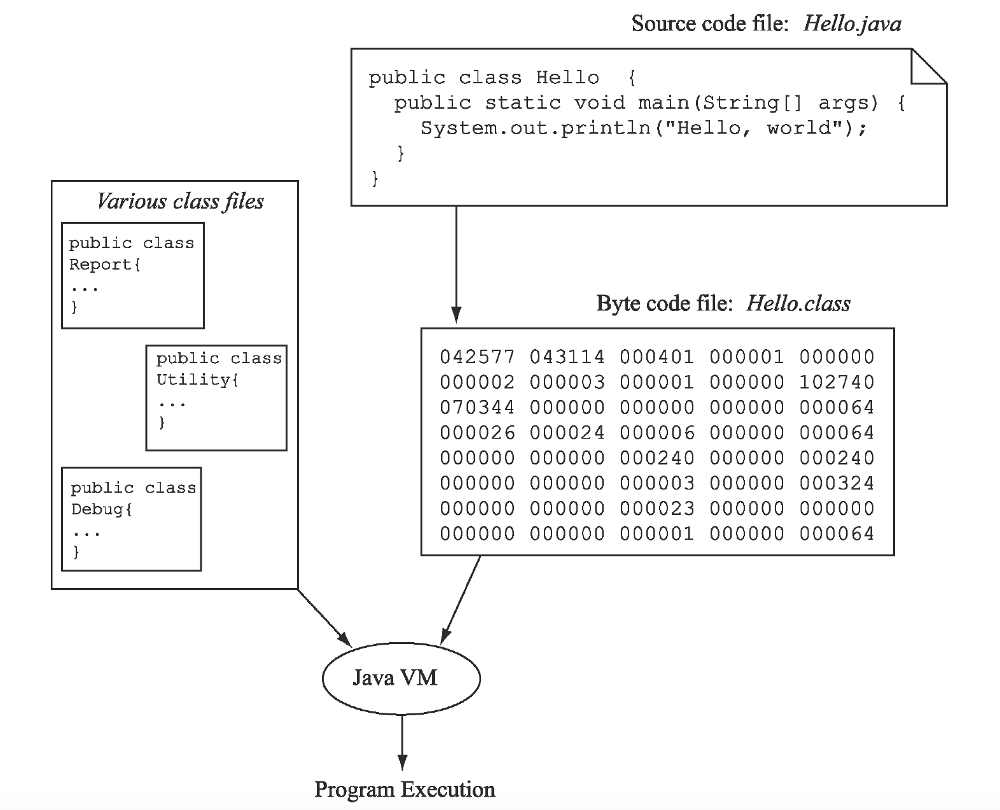

The programmer performs several steps when writing a computer program.
1. Write the source code for your program.
2. Compile the source code with an appropriate compiler.
3. Execute the compiled, executable program to test it.
4. Debug the program — find the errors and fix them.
5. Repeat the process as needed.

`Hello.java` is the _source code_. Source code is a human-readable file written in a programming language. In Java, all of your program code will be placed in a `class`.
```java
//Source code
public class Hello {
  public static void main(String[] args) {
    System.out.println("Hello, world");
  }
}
```

The source code is _compiled_ using the program `javac`.
> #### compiled ####
> Translated from your source code statements down to the most elementary level — machine instructions.

The compiled code becomes _executable code_. This is code that the computer can run. In Java, this is the `Hello.class` file that the `javac` program generated. The content of this file is called _byte code_.
> #### byte code ####
> Machine instructions that are executable by any Java Virtual Machine (JVM).

This program can be executed using the `java` command.

The executable code can use other class files that are known to the compiler. (Don't worry about these files for now.)



### Drill
`simpleprograms/drills`
* Open the file `Hello.class` using any text editor. Note how it is not human-readable. (If you can read it, you probably opened `Hello.java`.)

<hr>

[Prev](programming.md) -- [Up](README.md) -- [Next](programming-language.md)

