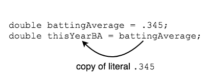

## Assignment

Remember that _declaring_ a variable is creating the variable for your program to use.
```java
int distanceTraveled;
double radius;
char middleInitial;
```

_Assignment_ is the action of putting a value in a variable.
```java
distanceTraveled = 42;
radius = 12.2;
middleInitial = 'A';
```

The first time a variable is assigned a value, we say it is _initialized_.

### Practice Exercise
A variable must be initialized before it can be used. Otherwise, there will be a compiler error at the line where the variable is used.

We can declare and initialize a variable in one line.
```java
double pi = 3.141592;
```

We can declare and initialize many variables in one statement, separated by commas.
```java
double battingAverage = .345, walkToStrikeoutRatio = 1.35, sluggingPercentage;
```
* Note that we don't have to initialize all variables in a statement.

We can also assign a variable the value of another variable.
* This copies the literal value from one variable to the other.

```java
double battingAverage = .345;
double thisYearBA = battingAverage;
//thisYearBA now has the value .345
```


Finally, we can reassign variables.

```java
double battingAverage = .345;
double thisYearBA = battingAverage;
battingAverage = .362; //reassignment

System.out.println(battingAverage);
System.out.println(thisYearBA);
```

### Drill
`variablesandconstants/drills/Assign.java`
* Run the code listed above, which reassigns `battingAverage`. Does this change `thisYearBA`?

<hr>

[Prev](literals.md) | [Up](README.md) | [Next](output.md)

