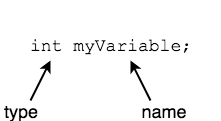

## Variables

A _variable_ is data that has a **name** and represents a **changing value** — the data in the variable may vary as the program runs.

In Java, a variable must be defined before it is used.

* This means giving the variable a _type_ and _name_.

* Another word for this is _declaring_ a variable.

>#### declare
> To create a variable for your program to use. It must have a type and name.
>
>

We can declare many variables in one line, separated by commas.
```java
int x1, x2, y1, y2;
```
* All the variables above have the type `int`.

### Drill
`variablesandconstants/drills/VariableNaming.java`
* Declare a variable of type `int` for the distance something (a car, a rocket) traveled.
* Declare a variable of type `int` for the distance between the center of a circle and its edge.
* Declare a variable of type `String` for a user's full name.

<hr>

[Prev](types.md) -- [Up](README.md) -- [Next](rules.md)

