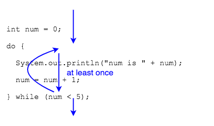

The `do-while` loop is similar to the `while` loop, except the condition is placed _after_ the loop body.

```
do
  loop body
while (condition);
```
The condition is checked at the end of each execution of the loop body; it determines if the loop body should execute _again_.
* This means that a `do-while` loop body will always execute _at least_ once.



```java
int num = 0;
do {
  System.out.println("num is " + num);
  num = num + 1;
} while (num < 5);
```

### Practice Exercise
Notable `do-while` differences:
* `do-while` must have a semicolon at the end.
* `do-while` will execute at least once.

```java
int num = 999;
do {
  System.out.println("num is " + num); //will execute even though num is not 0
} while (num == 0);
```

### Drill
Note: these are similar to the `while` loop drills, but do not copy-paste solutions. The purpose here is to practice writing the code.
`WhileLoops/src/drills/DoWhileLoop.java`
* Write a `do-while` loop to print the numbers 1 to 10 to the screen.
* Use Math.random() to write a do-while loop that will execute as long as a random number is less than 0.7. Declare a variable outside the loop, and assign a new Math.random() value in the loop body. Then print the number to the screen. Example: `double d = Math.random();`
  Add a statement after the loop to print the final value of d.

<hr>

[Prev](scope.md) -- [Up](README.md) -- [Next](infinite.md)

