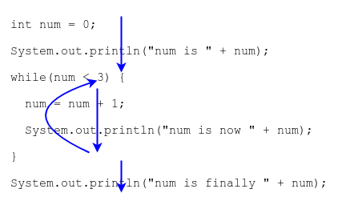

## Looping

Programs execute _sequentially_, or line-by-line.

A _loop_ can execute a section of code many times, over and over again.

When your program reaches a loop statement, it stops sequential execution and "loops through" the statements within the loop.

When the loop finishes, the program picks up after the loop.

[Prev](README.md) -- [Up](README.md) -- [Next](while.md)

