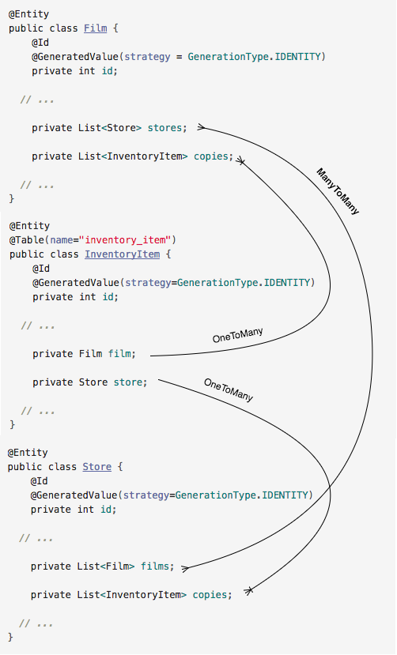

## Mapping Options with Association Classes

We have already modeled the `@ManyToMany` relationship between *Film*
and *Store* using `inventory_item` as the join table.

  * Using the `@ManyToMany` you can:

    * Retrieve all films in a store's inventory.

    * Find all stores that stock a certain film.

You can also model the `@OneToMany` relationship between *Film* and
*InventoryItem* so that you can:

  * Retrieve the condition of all of the copies of a certain film.

Similarly, you can model the `@OneToMany` between *Store* and *InventoryItem* so that you can:

  * Retrieve the condition of all of the items in a store's inventory.

You can choose whether to model one, two, or all three of the above, depending on your needs.

The resulting relationships will give you access to all the data from these three tables.

### Drill
> 1. Add a bi-directional, one-to-many relationship between *Film* and *InventoryItem*.
>
>    * Add a JUnit test in both *FilmTest* and *InventoryItemTest* test to ensure this association is working.
>
> 1. Add another bi-directional, one-to-many relationship between *Store* and *InventoryItem*. Don't forget to generate get/set methods for each new field.
>
>    * Add a JUnit test in both *StoreTest* and *InventoryItemTest* to ensure this association is working.

[Prev](associationClasses.md) -- [Up](README.md) -- [Next](labs.md)

