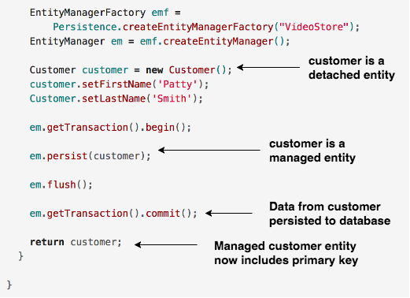

## Update operations

### Managed vs. Detached Entities

An entity can be either managed or detached.

> **Managed Entity**  
> An entity that is currently tracked by the EntityManager. Any object we retrieve from the database via a READ operation will be managed.

> **Detached Entity**  
> An entity that is currently not connected to the EntityManager. Any locally created object is said to be detached.
>
> ```java
> Customer c = new Customer();
> ```

For example, when we were persisting a new entity to the database (`INSERT`), the object was _detached_ until we called `em.persist`, then added to the database when the transaction was committed.  



### Performing UPDATEs
Modifying a managed entity will result in a change to the database (`UPDATE`) upon a transaction commit (but not until the commit). Whereas, changing a detached entity has no effect on the database.
  * You do not need to call any additional *EntityManager* methods.

This is confusing... let's look at an example:

```java
public class Example {
  public void illustrateManagedVsDetached() {
    EntityManagerFactory emf =
        Persistence.createEntityManagerFactory("VideoStore");
    EntityManager em = emf.createEntityManager();

    // open a transaction
    em.getTransaction().begin();

    // create a "detached" customer entity
    Customer detachedCustomer = new Customer();

    // retrieve a "managed" customer entity
    Customer managedCustomer = em.find(Customer.class, 1);

    // update the values of the detached entity
    detachedCustomer.setFirstName("Nope");
    detachedCustomer.setLastName("Not Gonna Happen");

    // update the values of the managed entity
    managedCustomer.setFirstName("Will Update");
    managedCustomer.setLastName("On Commit");

    // actually make changes
    em.getTransaction().commit();
    // -> the detached entity's changes were not saved
    // -> the managed entity's changes HAVE been saved

  }
}
```


* When you retrieve your *EntityManager* from an *EntityManagerFactory*, your `find` or `createQuery` methods return managed entities.

### Determining if Entities are Managed
The following options can be used for complex logic in a DAO, though most of the time they will not be necessary.

* Call *EntityManager*'s `contains` to determine if a particular entity is managed or detached.

  * `contains` returns true if the entity is managed.

* To detach an entity, pass it to *EntityManager*’s `detach` method.

  * Call *EntityManager*'s `clear` method to detach all managed entities.

* Pass a detached entity to *EntityManager*’s `merge` method to get back a managed version.

  * The passed-in entity remains detached, but the returned object is managed.

* Call *EntityManager*'s `refresh` to reload data into an entity from the database, replacing any pending changes.

### Drill
> 1. In your _ActorDAO_ create the following abstract method: `public Actor update(int id, Actor actor);`
>
> 1. Implement the `update` method in your _ActorDAOImpl_:
>
>    * Use the provided `id` to retrieve a managed _Actor_ entity (`em.find`).
>
>    * Once you retrieve the correct _Actor_, use its set methods to update the managed _Actor_ entity with the values in the _Actor_ parameter passed into the method.
>
>    ```java
>    public Actor update(int id, Actor updatedActor){
>      // ...
>    
>      Actor managed = em.find(Actor.class, id);
>      managed.setFirstName(updatedActor.getFirstName());
>    
>      // ...
>    
>      return managed;
>    }
>    ```
>
>
>    * On `commit()` the managed entity will be updated.
>
>    * Return the updated managed entity.
>
1. To test that your `update` is working, modify *ActorDAOTest* by commenting out your `create` (we don't want to create lots of duplicates), and instead using `update` to change the first and last name of the *Actor* you created in the previous Drill.

<hr>

[Prev](create.md) -- [Up](README.md) -- [Next](delete.md)

