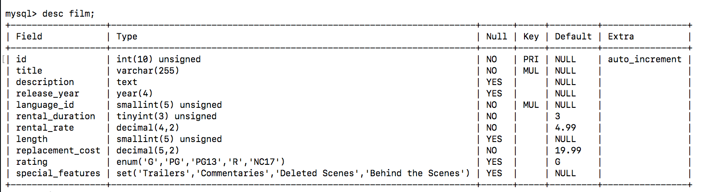
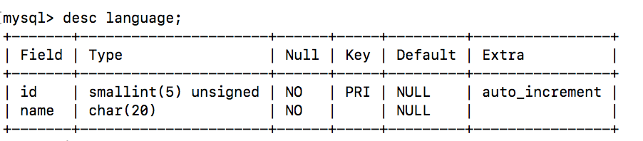

## Setting Foreign Keys with JPA
We are going to use the _Film_ and _Language_ tables and entities for this example.

  




We have previously configured a `@ManyToOne` relationship between _Language_ and _Film_. Looking at the tables we can see that a _Film_ has a not null foreign key column called `language_id`.

To execute an INSERT on the _Film_ table, we have to provide a value for that column or we will get a `Foreign Key Constraint`.

```sql
INSERT into Film (title, description, language_id) VALUES ("Something", "A description", 1);
```

As we know by now, JPA deals in *Objects* not columns. When creating a new _Film_ we can use the setters to add a `title` and `description`, but what about the `language_id`?

When we created the relationship between _Film_ and _Language_ we added a field of type _Language_ to the _Film_ class.

```java
@ManyToOne
@JoinColumn(name = "language_id")
private Language language;
```

This field represents the `language_id` and needs to be set before we can persist properly.

In order to set the foreign key and establish the appropriate relationship in SQL, we need to set the `address` field with the _Managed Entity_ representing _Address_ with id 1. The example below shows how we would accomplish this.

```java
EntityManagerFactory emf =
    Persistence.createEntityManagerFactory("VideoStore");
EntityManager em = emf.createEntityManager();

Film film = new Film();
film.setTitle("Something");
film.setDescription("A description");

Language lang = em.find(Language.class,1);
film.setLanguage(lang);   // sets the foreign key language_id to 1 when persisted

em.getTransaction().begin();
em.persist(film);
em.flush();
em.getTransaction().commit();
```

<hr>

[Prev](README.md) | [Up](README.md) | [Next](persistingMultipleElements.md)

