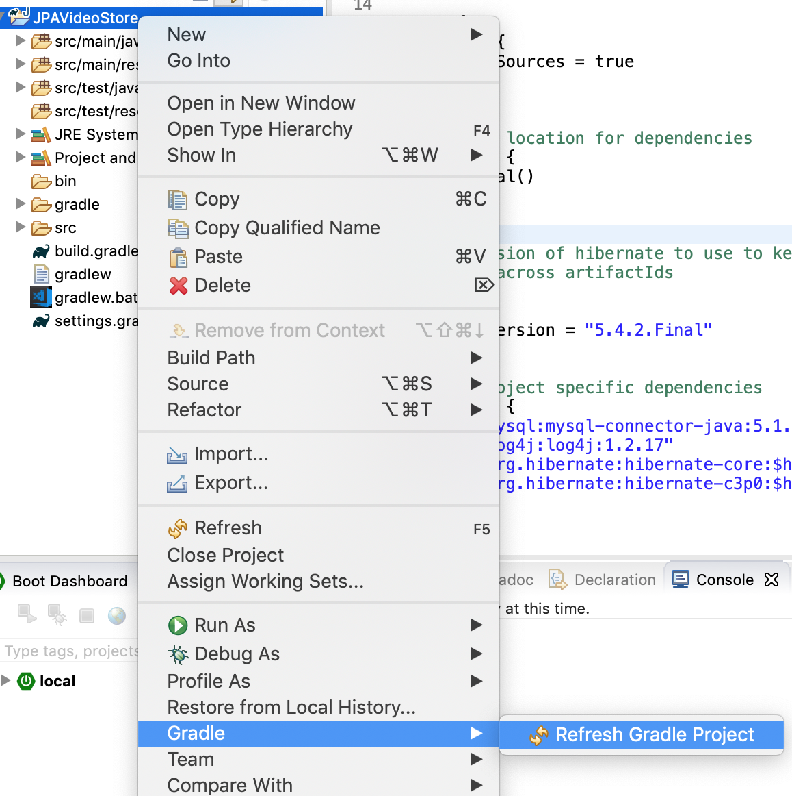
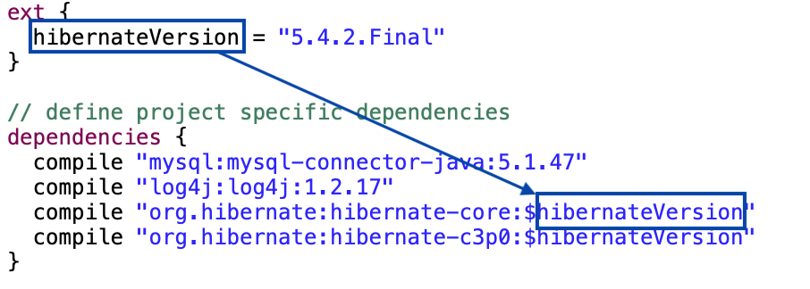

## Dependencies

The dependencies and overall Gradle build will be different for a JPA project vs what we have done with web applications.

JPA requires several additional JAR files:

* A JDBC driver to communicate with the database (_MySQL_).

* A persistence provider that implements the JPA interfaces (_Hibernate_).

We will also incorporate several optional libraries to improve JPA's performance:

* A logging framework to control the persistence provider's output making it easier to debug (_log4J_).

* A connection pool library which will scale with production (_c3p0_).

  * Without c3p0, Hibernate's connections go to sleep after ~24 hours. If a user tries to access a sleeping connection pool, they will initially be served an error. To improve user experience, c3p0 ensures that the connection pool remains open.

We will be including these dependencies with Gradle.

### Drill
>
>1. Replace the contents of the *build.gradle* file with the following configuration:
>
>    ```groovy
>    apply plugin: 'java'
>    apply plugin: 'eclipse'
>    
>    /*
>    name your project's dependency group and give it an initial version.
>    the 'artifactId' is assigned automatically based on the project's name.
>    */
>    group = 'com.example.videostore'
>    version = '0.0.1-SNAPSHOT'
>    
>    // JDK versioning for compilation and generated bytecode
>    sourceCompatibility = 1.8
>    targetCompatibility = 1.8
>    
>    eclipse {
>      classpath {
>        downloadSources = true
>      }
>    }
>    
>    // set query location for dependencies
>    repositories {
>      jcenter()
>    }
>    
>    /*
>     set the version of hibernate to use to keep your dependencies DRY and
>     consistent across artifactIds
>    */
>    ext {
>      hibernateVersion = "5.4.32.Final"
>      mySqlConnectorVersion = "8.0.27"
>    }
>    
>    // define project specific dependencies
>    dependencies {
>      implementation "mysql:mysql-connector-java:$mySqlConnectorVersion"
>      implementation "log4j:log4j:1.2.17"
>      implementation "org.hibernate:hibernate-core:$hibernateVersion"
>      implementation "org.hibernate:hibernate-c3p0:$hibernateVersion"
>    }
>    ```
>
> 1. Refresh the Gradle nature of the *JPAVideoStore* project by right clicking on the project, and then selecting _Gradle -> Refresh Gradle Project_
>
>    
>
>    * Now all of your dependencies should be visible in _Project and External Dependencies_, and your compiled class files should be visible within their packages inside of the build directory.

##### ***What is `ext { }` doing?***

* If you have multiple dependencies from the same groupId, it is useful to ensure that they are of the same version (this decreases the likelihood of dependency hell).

* In the example above, we are using a `ext { }` task to set a version of hibernate we wish to use for all of the hibernate dependencies.

* This could also be useful if you had multiple Spring jars and wanted to ensure that they were all the same version.

  

<hr>

[Prev](whatIsJPA.md) | [Up](README.md) | [Next](persistenceXml.md)

