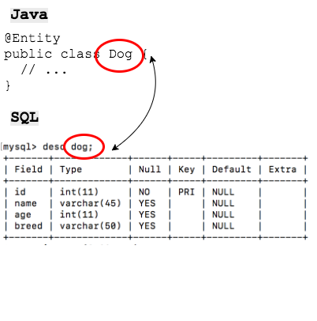
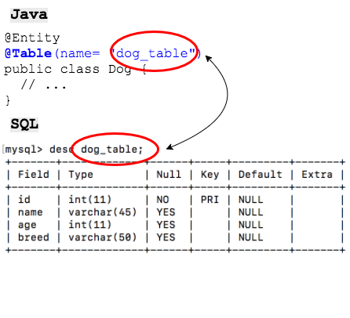

## Entity Classes

An entity is a *Plain Old Java Object* (POJO) whose fields represent a row in a database table.

* An entity **MUST** have a public (or protected) *no-argument constructor*.

* Fields **must not** be marked *public* or *final*.

The `@Entity` annotation is used to declare a class as an entity:

* If your class name **matches** the table name, JPA will find the table by itself.

  

If your class name **does not** match the table name, then identify the table name with the `@Table` annotation.



You must annotate the field that maps to your primary key using the `@Id` annotation:

```java
@Entity
public class Dog {
  @Id
  private int id;

  // ...
}
```

### Practice Exercise
`@Entity` and `@Id` are the only two required annotations for a valid entity class.  


### Including *Entities* In your Persistence Unit

In order for the _Persistence Unit_ to know about the _Entities_ it manages, we need to include them in the `persistence.xml` within `<class></class>` tags.

*Entities* are included with the convention _package.class_ within the Persistence Unit:

```xml
<persistence-unit name="PetStore">
  <!-- List Entities Here -->
  <class>entities.Dog</class>

  <!-- ... -->
</persistence-unit>
```

### Drill
* A JPA *Entity* is the Java equivalent of a SQL table.
* The corresponding table for the *Customer* entity looks like:
   ```
   mysql > desc customer;
   +------------+-------------+------+-----+---------+----------------+
   | Field      | Type        | Null | Key | Default | Extra          |
   +------------+-------------+------+-----+---------+----------------+
   | id         | int(11)     | NO   | PRI | NULL    | auto_increment |
    ...
   +------------+-------------+------+-----+---------+----------------+
   ```
* Create a new class that represents the *customer* table as an *Entity*.

  * Name the class `Customer` and place it in a package named `com.example.jpavideostore.entities`. For now, add a field for:
    * `id`

* Annotate the *Customer* class with `@Id` and `@Entity`.

* Generate a no-arg constructor (you must have one in every JPA entity).

* Generate getters and setters for the fields.

* Add the class to your `persistence.xml`

  * **NOTE** your entity class will need its full package and class name: `<class>com.example.jpavideostore.entities.Customer</class>`

<hr>

[Prev](persistenceXml.md) -- [Up](README.md) -- [Next](mappingFields.md)

