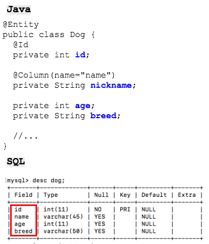

## Mapping Entity Attributes

By default, JPA will attempt to access columns on your table based on the names of the fields you create.

Annotate fields that don't match the names of your columns with `@Column` using `name` to specify the column name.



The persistence provider will assume that all of an Entity's fields are mapped to the database.

* If you wish to add a field to your entity that is not mapped to a column in the database, mark that field as `@Transient`.

  ```java
  @Entity
  public class Dog {
    @Id
    private int id;
  
    @Column(name="name")
    private String nickname;
    private int age;
    private String breed;
  
    @Transient
    private int ageInDogYears;
  }
  ```

As all of the fields are private, you will also need to add get/set methods so that the Entity's values are accessible.

```java
@Entity
public class Dog {
  @Id
  private int id;

  @Column(name="name")
  private String nickname;
  private int age;
  private String breed;
  // ...

  public int getId() {
    return this.id;
  }
  public void setId(int id) {
    this.id = id;
  }
  public String getNickname() {
    return this.nickname;
  }
  public void setNickname(String nickname) {
    this.nickname = nickname;
  }
}
```

#### Java Primitives and Database NULLs

Java primitive types (`int`, `double`, `boolean`, etc.) cannot have a Java `null` value - only reference variables can be null.

If JPA retrieves an entity record with a NULL database value for a primitive-type field, it throws an exception.

One strategy for dealing with this is to use Java's wrapper classes for entity fields mapped to nullable database columns:

```java
@Entity
public class Dog {
  @Id
  private int id;

  @Column(name="name")
  private String nickname;
  private Integer age;    // Nullable reference variable.
  private String breed;
  // ...
```

* Primary key columns can never be null, so our `id` field is safe, but now a `dog` record with a NULL `age` column will not result in an exception.


### Drill
>    ```
>    mysql > desc customer;
>    +------------+-------------+------+-----+---------+----------------+
>    | Field      | Type        | Null | Key | Default | Extra          |
>    +------------+-------------+------+-----+---------+----------------+
>    | id         | int(11)     | NO   | PRI | NULL    | auto_increment |
>     ...
>    | first_name | varchar(50) | YES  |     | NULL    |                |
>    | last_name  | varchar(45) | NO   | MUL | NULL    |                |
>    | email      | varchar(50) | YES  |     | NULL    |                |
>     ...
>    +------------+-------------+------+-----+---------+----------------+
>    ```
> * Add fields to your `Customer` class:
>     * `firstName` -> SQL column name is `first_name`
>     * `lastName` -> SQL column name is `last_name`
>     * `email` -> SQL column name is `email`...no `@Column` necessary
>
> * Generate getters and setters for the new fields.
>
> * Add a `toString` method to the class.
>

<hr>

[Prev](entityClass.md) -- [Up](README.md) -- [Next](entityManager.md)

