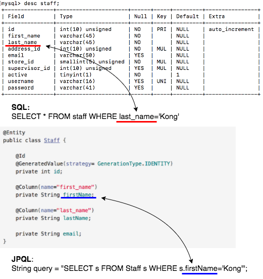
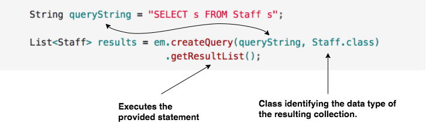

## Basic Queries with JPQL

_Java Persistence Query Language_ (JPQL) is a SQL-like syntax for querying the database.

Unlike SQL, JPQL is concerned with entities and their properties, not tables and their columns.

Similarly to when we did _JDBC_, we store our queries into String variables.

The following example illustrates what the JPQL query would look like to retrieve all _Staff_ members:

```java
String queryString = "SELECT s FROM Staff s";

```

Unlike SQL, JPQL requires an alias for each class mentioned in the FROM
clause. In our case, the `s` is the alias for _Staff_. We could have
used the `AS` reserved word to clarify the fact that `s` is an alias:

```java
String queryString = "SELECT s FROM Staff AS s";
```

### Where clause
When specifying a _where_ clause in JQPL we use the object's field names instead of the SQL column names.



  * Above, we evaluate the value of the *Staff* entity's `lastName` property, to query those records where the `lastName` is equal to `"Kong"`, just as we would in SQL, except, instead of querying by the value of a column, we are using the actual property name.

JPQL statements are not case sensitive, except when it comes to entity and property names. The following statement would fail because of the lowercase `s` in `staff` and the lowercase `n` in `lastname`:

```java
String query = "SELECT s FROM staff s WHERE s.lastname = 'Kong'";
```
### Aggregating multiple results
_EntityManager_’s `find` method returns a single entity based on the
provided primary key.

  * The example below queries the provided entity (e.g. queries the corresponding table) for the primary key provided (1), and casts the returned values to the appropriate Java type (_Staff_).

```java
Staff s = em.find(Staff.class, 1);
```
Use a JPQL query instead of a `find` to retrieve multiple entities.

Call the `createQuery` method available in the *EntityManager*, passing in two arguments.

  * First, a JPQL `SELECT` statement that identifies what to retrieve.

  * Second, a class (e.g. `Staff.class`) identifying the data type of the resulting collection.

The `createQuery` method returns a `TypedQuery` object, which we can use to query the database.

We can chain a call to `getResultList` on the _TypedQuery_ object to get a _List_ of entities of the requested type.



  * The SELECT statement above returns **Staff** objects, not rows from the database.

### Drill
1. Create a class named *JPQLClient* in the *com.example.jpavideostore.client* package.  
> 1. In `main`, create an `EntityManagerFactory` and an `EntityManager`.
> 1. Write a JPQL query to retrieve any staff member whose id is less than 10.
>    * Think about what the SQL query for this would be... how would you write that with JPQL?
> 1. Iterate over the returned collection and print off every employee's first and last names.

<hr>

[Prev](README.md) -- [Up](README.md) -- [Next](queryingForProperties.md)

