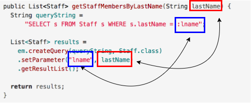

## Query Parameters

Substitute values for embedded JPQL placeholders with the `setParameter` method.

Your JPQL statement can identify query parameters via a variable name.

  * Specify named parameters with `:name` syntax

```java
    String queryString =
      "SELECT s FROM Staff s WHERE s.email = :email";

    List <Staff> results =
      em.createQuery(queryString, Staff.class)
      .setParameter("email", "andrew@example.com")
      .getResultList();
```

The `setParameter` method is called on the *TypedQuery* and returns the modified *TypedQuery*, allowing you to chain additional methods on it.

It is also possible to have more than one parameter in a single query string. Simply chain additional `setParameter` methods onto the *TypedQuery* as below:

```java
    String queryString =
      "SELECT s FROM Staff s WHERE s.firstName = :fname AND s.lastName = :lname";

    List<Staff> results =
      em.createQuery(queryString, Staff.class)
      .setParameter("fname","Lisa")
      .setParameter("lname", "Kong")
      .getResultList();
```

This parameterization allows you to easily use user-entered input in queries, while also preventing SQL injection attacks (the `setParameter` method sanitizes inputs).



  * This example illustrates how these parameters could be used in a method to allow users to search for Staff members by their last names.

### Drill
> 1. Change your *JPQLClient* program to use a parameter for the id value rather than hard coding the `WHERE s.id < 10`.

<hr>

[Prev](retrieveMultipleProperties.md) | [Up](README.md) | [Next](labs.md)

