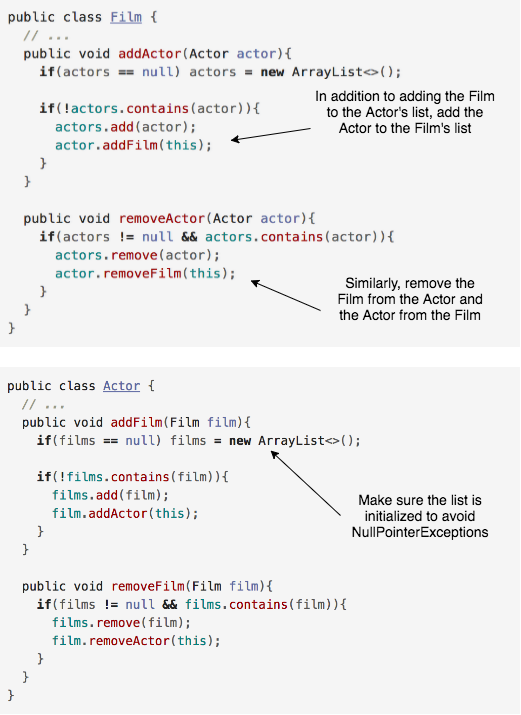

We have seen how we can create `add` and `remove` methods for `@ManyToOne` relationships. We can apply the same concept to `@ManyToMany`.

  * Each side of the relationship stores a collection of the opposite side. Therefore, we are going to need `add` and `remove` methods in both entities.
  * You must ensure, for data integrity, that the entity is added or removed from both collections.

### Example Using Actor and Film

### Practice Exercise
In order for the collection's `contains` method to work properly your class must have a `equals` method implemented.

[Prev](manyToMany.md) -- [Up](README.md) -- [Next](eagerAndLazy.md)

