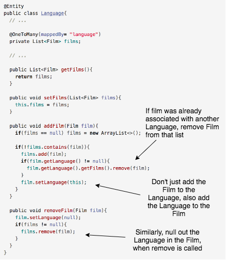

## Add and Remove Methods
When an entity has a field that is a collection, we need to do a little extra work in addition to adding the basic get/set methods.

  * The get method will return the whole collection.

  * The set method will replace the whole collection.

We are going to create methods to *add* a single entity to a collection as well as *remove* one from a collection.
  * With a bi-directional relationship, your application code needs to account for both sides of the relationship. This ensures that the changes will be written to the database.

**Note:** In order for your add/remove/set method changes to be reflected in the database, the methods must be called inside of a transaction.

### Drill
Modify your _Language_ class by adding `addFilm` and `removeFilm` methods.

### Practice Exercise
The `addFilm` and `removeFilm` methods are not necessary, but will make manipulating collections much easier.

[Prev](biDirectionalManyToOne.md) -- [Up](README.md) -- [Next](labs.md)

