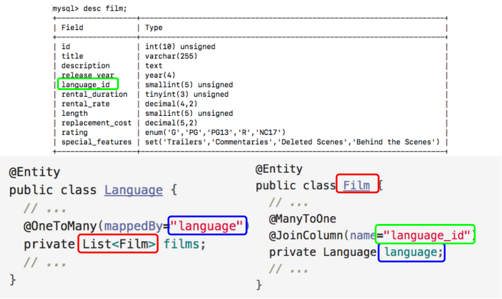

## Bi-directional `@ManyToOne`

In a bi-directional, many-to-one relationship, the owning side is mapped just like its uni-directional counterpart.

```java
@Entity
public class Film {
  // ...
  @ManyToOne
  @JoinColumn(name="language_id")
  private Language language;
  // ...
}
```

In the _non-owning_ entity of a bi-directional relationship, add the `@OneToMany` annotation above the field that references the owning entity.

  * Use the *mappedBy* element on the `@OneToMany` annotation to specify the defining field in the owning entity.

```java
@Entity
public class Language {
  // ...
  @OneToMany(mappedBy="language")
  private List<Film> films;
  // ...
}
```

  * Make the field of type *Collection*, *List*, or *Set* and give it a plural name.

  

### Drill
> 1. Create a bi-directional, many-to-one relationship between your *Film* and *Language* entities.
>
>    * Modify *Film*, add a field of type *Language* annotated with `@ManyToOne` and `@JoinColumn`.
>
>    * As a bi-directional relationship, the *Language* entity must also be updated. Add a field of type `List<Film>`, annotate it with `@OneToMany`, and set the *mappedBy* element to the corresponding field in *Film*.
>
>    * Also, add get and set methods in each class for the new fields.
>
> 1. Update your JUnit tests for *Film* and *Language* to verify that the association works successfully in both directions.


<hr>

[Prev](uniDirectionalManyToOne.md) -- [Up](README.md) -- [Next](addAndRemove.md)

