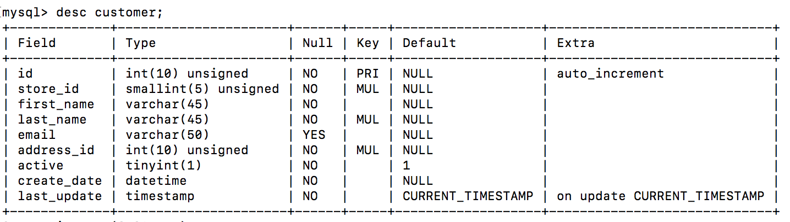
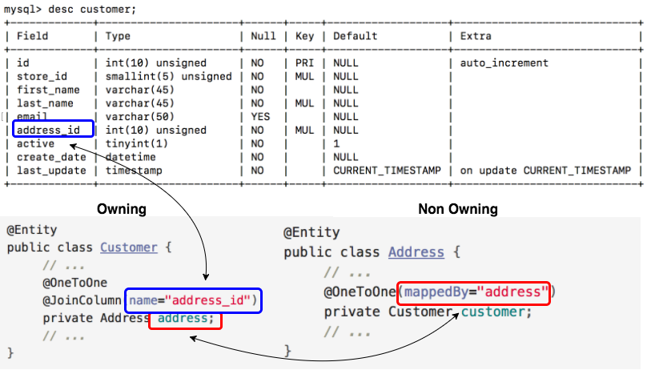

## `@OneToOne`

Use the `@OneToOne` annotation to describe a one-to-one relationship.

* Annotate the defining field in the _owning entity_ to specify mapping
details.

  * The owning entity is the one whose corresponding database table contains the _foreign key_ which models the relationship.

  * Use the `@JoinColumn` annotation to specify the foreign key _column name_.

  

```java
@Entity
public class Customer {
     // ...
     @OneToOne
     @JoinColumn(name="address_id")
     private Address address;
     // ...
}
```

* In the non-owning entity of a _bi-directional_ relationship, add the `@OneToOne` annotation above the field that references the owning entity.

  * Use the `mappedBy` element on the `@OneToOne` annotation to specify the defining field in the owning entity.

```java
@Entity
public class Address {
     // ...
     @OneToOne(mappedBy="address")
     private Customer customer;
     // ...
}
```
### Digging Deeper



* For a uni-directional relationship, omit the second `@OneToOne` annotation (with the ***mappedBy*** element), and the field it decorates.
 You only need a field and mapping in the owning entity of a uni-directional relationship.

### Drill
> 1. Delete the field and the gets/sets for `addressId` from your `Customer` class.
>    ```
>    @Column(name="address_id")
>    public int addressId;
>    ```
>    This will break the `CustomerRelationshipClient` due to the fact that the gets/sets we are calling no longer exist. Because this was just a demo, it's not a problem. Comment out the `main` to get rid of the errors.
>
> 1. Create a uni-directional, one-to-one relationship between your *Customer* and *Address* entities.
>
>    * First, in *Customer*  add a field of type *Address* annotated with `@OneToOne` and `@JoinColumn`.
>
>      Here is the _customer_ table for you to reference:
>
>      ```bash
>      +-------------+----------------------+------+-----+-------------------+-----------------------------+
>      | Field       | Type                 | Null | Key | Default           | Extra                       |
>      +-------------+----------------------+------+-----+-------------------+-----------------------------+
>      | id          | int(10) unsigned     | NO   | PRI | NULL              | auto_increment              |
>      | store_id    | smallint(5) unsigned | NO   | MUL | NULL              |                             |
>      | first_name  | varchar(45)          | NO   |     | NULL              |                             |
>      | last_name   | varchar(45)          | NO   | MUL | NULL              |                             |
>      | email       | varchar(50)          | YES  |     | NULL              |                             |
>      | address_id  | int(10) unsigned     | NO   | MUL | NULL              |                             |
>      | active      | tinyint(1)           | NO   |     | 1                 |                             |
>      | create_date | datetime             | NO   |     | NULL              |                             |
>      | last_update | timestamp            | NO   |     | CURRENT_TIMESTAMP | on update CURRENT_TIMESTAMP |
>      +-------------+----------------------+------+-----+-------------------+-----------------------------+
>      ```
>
>    * Also, replace the get/set methods with new versions.
>
>    * Because this is a uni-directional relationship, the *Address* entity remains unchanged.
>
> 1. Update *CustomerTest* so that it tests your new relationship.
>  
>  ```java
>    @Test
>    public void test_customer_to_address_association() {
>       Customer cust = em.find(Customer.class, 2);
>       Address address = cust.getAddress();
>       assertEquals("1121 Loja Avenue", address.getStreet());
>       assertEquals("", address.getStreet2());
>       assertEquals("San Bernardino", address.getCity());
>       assertEquals("17886", address.getPostalCode());
>    }
>  ```

<hr>

[Prev](README.md) -- [Up](README.md) -- [Next](labs.md)

